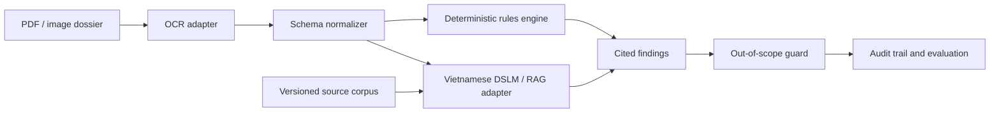

# Architecture

The current MVP implements the schema boundary, deterministic checks, citation attachment, scope guard and audit output. OCR and DSLM/RAG are explicit adapters so they can be evaluated independently.

## Design constraints

- Every conclusion carries a source identifier.
- Unsupported questions return an out-of-scope warning.
- Rulesets and source corpora are versioned.
- Local inference is the default deployment target.
- Evaluation logs are reproducible without private data.

