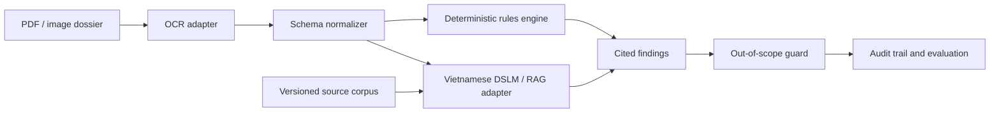

# Architecture

The current MVP implements the structured dossier boundary, a versioned OCR-adapter contract, deterministic checks, citation attachment, scope guard, and audit output. The OCR contract validates extraction output, confidence, and provenance; it is not an OCR model. OCR models and DSLM/RAG remain explicit adapters so they can be evaluated independently.

The implemented OCR boundary is documented in [ocr-adapter.md](ocr-adapter.md) with machine-readable schemas under [`schemas/`](../schemas/).

## Design constraints

- Every conclusion carries a source identifier.
- Unsupported questions return an out-of-scope warning.
- Rulesets and source corpora are versioned.
- Local inference is the default deployment target.
- Evaluation logs are reproducible without private data.

